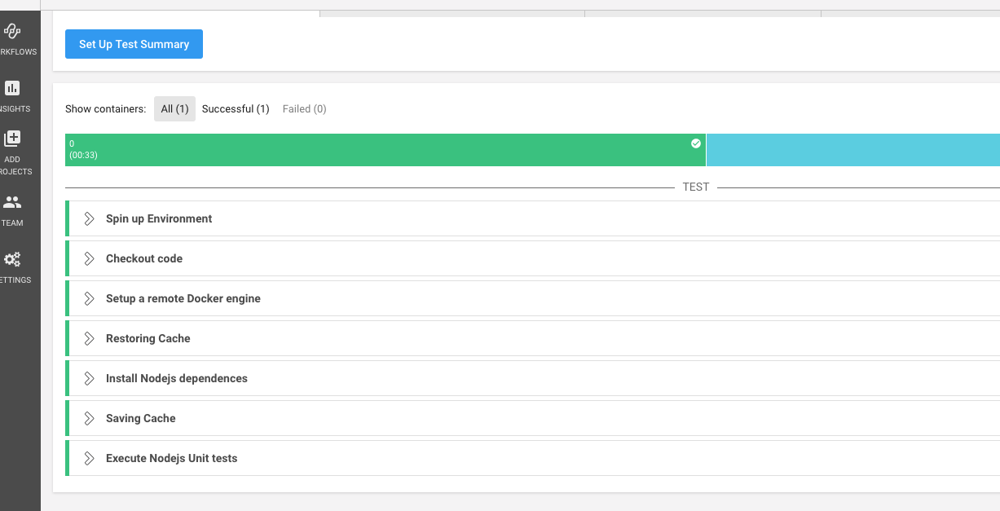
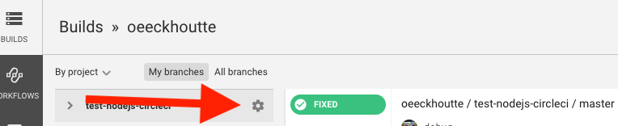
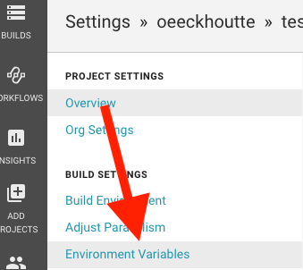
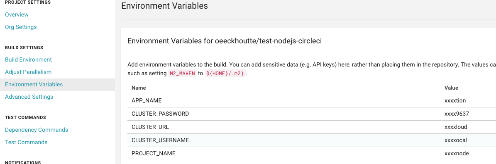

# Build a CI/CD pipeline for a NodeJS application using S2I

* SCM             : github (https://github.com)
* CICD platform   : CircleCI (https://circleci.com)
* PAAS            : https://manawa.euw1-gcp-poc.adeo.cloud/console/


## Prerequisite :

You will need the oc cli (Openshift Command Line Interface) installed on your laptop to initialize your Openshift project.

You can find the instructions to install it bellow. 
* For Windows: https://blog.openshift.com/installing-oc-tools-windows/
* For OS X: 
  * Option 1: 
  
  If you have Homebrew (https://brew.sh/) installed:

  Open a new terminal and enter this command: 
  `brew install openshift-cli`
  * Option 2:
  
  Open a new terminal and enter the following commands.
  ```
  wget https://github.com/openshift/origin/releases/download/v3.10.0-rc.0/openshift-origin-client-tools-v3.10.0-rc.0-c20e215-mac.zip

  unzip -a openshift-origin-client-tools-v3.10.0-rc.0-c20e215-mac.zip
  
  mv ./oc /usr/local/bin/
  ```


* For Linux:  
```
wget https://github.com/openshift/origin/releases/download/v3.10.0-rc.0/openshift-origin-client-tools-v3.10.0-rc.0-c20e215-linux-64bit.tar.gz

tar -xvzf openshift-origin-client-tools-v3.10.0-rc.0-c20e215-linux-64bit.tar.gz

mv openshift-origin-client-tools-v3.10.0-rc.0-c20e215-linux-64bit/oc /usr/local/bin
```

## Step 1 : Init your Github repo
1. Create a new `hello-world-node` repo on your github account
2. Copy our sample `hello-world-node` application from `node/step1` directory and paste it somewhere on your filesystem. Then init and push your git repo :

```shell
git clone https://github.com/adeo/manawa--cicd-workshop/
cd manawa--cicd-workshop/
cp -r node/step1/hello-world-node <path>
cd <path>/hello-world-node
git init
git add --all
git commit -m "initial commit"
git remote add origin https://github.com/<your_username>/hello-world-node.git
git push origin master
```

## Step 2 : Continuous Integration

In this section we are going to build your application using CircleCI and execute some unit tests.

* Add the sample circleci configuration provided in step2 directory.
* Push CircleCI configuration to github

```shell
cp -r node/step2/.circleci <path>/hello-world-node
cd <path>/hello-world-node
git add .circleci
git commit -m "Add CircleCI configuration"
git push origin master
```

The CircleCI yaml file is needed by CircleCI to identify your project as importable. This config describe the pipeline steps that will be executed during the job. To configure circleci to build your github projet :

* Create your CircleCI account
* Build your project
* You should see an output similar to this :




You now have a valid continuous integration pipeline that will build and deploy your code on Manawa each time you push an update to github.


## Step 3 : Continuous deployment

### Manawa build configuration

* Create a project in Manawa and a Manawa build config

> Please name your project like this: devweek-<your_ldap_username>-hello-world-node (e.g. 'devweek-2000xxxx-hello-world-node)

```
oc login -u <CLUSTER_USERNAME> -p <CLUSTER_PASSWORD> <CLUSTER_URL>
oc new-project <PROJECT_NAME>
oc new-build --docker-image=registry.hub.docker.com/ryanj/centos7-s2i-nodejs:current --binary=true --name=hello-world-node
```

### CircleCI configuration

Now we are going to add a deployment step in your existing pipeline to deploy your application on Manawa each time an update is pushed to Github.

* Copy the file `.circleci/config.yml` from the step3 directory and replace your existing file : `.circleci/config.yml`

```shell
cp -r node/step3/.circleci/config.yml <path>/hello-world-node/.circleci/
```

* Configure CircleCI and add the environment variables needed by the CircleCI configuration file.

*From the home page of CircleCI:*





> Set the following variables:
> * APP_NAME --> Name your application `hello-world-node`
> * PROJECT_NAME --> Like before name your project like this: devweek-<your_ldap_username>-hello-world-node
> * CLUSTER_URL --> https://manawa.euw1-gcp-poc.adeo.cloud/
> * CLUSTER_USERNAME --> Your LDAP username 
> * CLUSTER_PASSWORD --> Your LDAP password




* Push CircleCI configuration to github


```shell
git add .circleci/config.yml
git commit -m "Add deployment step"
git push origin master
```


### Manawa app creation

* In the previous section (CircleCI Configuration) we pushed a CircleCI config file to Github. The **oc commands** included in the CircleCI config file and executed pushed our source code to Manawa. The source code is stored. We can now use it to deploy an application on Manawa. Let's create an application...

```
oc new-app hello-world-node
```

* It's necessary to create a HTTPS route in order to access to your application. You can simply use the command below :

```
oc create route edge --service=hello-world-node
```

### Test the Continuous Deployment

* Edit the page : `views/index.html`, l. 219 replace :
```html
<h1>Welcome to your Node.js application on OpenShift</h1>
```

by
```html
<h1>Welcome to <your_username> Node.js application on OpenShift</h1>
```

```shell
git commit -m "Update view index.html to display my username"
git push origin master
```
